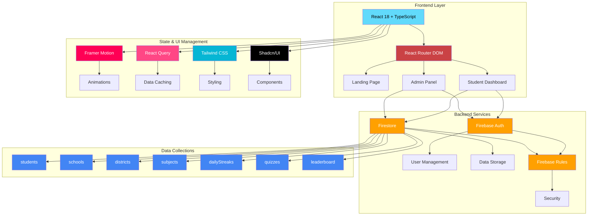

# MindLeap Platform - Project Overview

## 🎯 Platform Purpose

MindLeap is a comprehensive educational platform designed to revolutionize K-12 learning through interactive, gamified experiences. The platform aims to:

- **Engage Students**: Transform traditional learning into an exciting journey with daily challenges, quizzes, and streak-based rewards
- **Empower Educators**: Provide administrators and teachers with powerful tools to manage content and track student progress
- **Connect Communities**: Bridge the gap between schools, students, and parents through integrated learning experiences
- **Scale Education**: Enable nationwide deployment across states, districts, and schools with hierarchical management

## 🏗️ Major Subsystems

### 1. **Landing Page** 🌐
The public-facing gateway that introduces MindLeap to potential users:

- **Hero Section**: Engaging introduction with animated elements and clear call-to-actions
- **Features Showcase**: Interactive cards highlighting platform capabilities
- **School Portal**: Dedicated section for institutional partnerships
- **Contact System**: Multi-channel communication (WhatsApp, email, contact forms)
- **Responsive Design**: Optimized for all devices with smooth animations

### 2. **Student App** 🎓
The core learning environment where students engage with educational content:

#### Key Features:
- **Student Dashboard**
  - Personalized greeting with real-time stats
  - Points and streak tracking with visual indicators
  - Shield progression system (Bronze → Silver → Gold → Platinum)
  - Quick access to all learning modules

- **Daily Streak Challenge**
  - One question per day from scheduled subjects
  - Subject rotation based on weekday
  - Points system (200 for correct, 100 for participation)
  - Visual calendar showing streak history

- **Interactive Quizzes**
  - Subject-based knowledge testing
  - Real-time feedback and explanations
  - Timed challenges with score tracking
  - Targeted by location (state/district/school)

- **Live Learning**
  - Webinars with live streaming integration
  - Workshops for hands-on learning
  - Registration and attendance tracking
  - Recording access for later review

- **Gamification Elements**
  - Leaderboards (global, state, district, school)
  - Achievement badges and rewards
  - Progress visualization
  - Competitive rankings

### 3. **Admin App** 👨‍💼
Comprehensive management system for platform administrators:

#### Management Modules:
- **School Management**
  - Add/edit/delete educational institutions
  - Status control and bulk operations
  - Geographic organization (state → district → school)

- **Student Management**
  - Individual and bulk registration
  - CSV/Excel import capabilities
  - Profile management and enrichment
  - Account status control

- **Content Management**
  - Quiz and question creation
  - Daily streak question scheduling
  - Subject-wise organization
  - Difficulty balancing

- **Analytics & Reporting**
  - Student performance tracking
  - Engagement metrics
  - School-wise analytics
  - Downloadable reports

## 🔧 High-Level Architecture

### Architecture Components:

#### **Frontend Stack**
- **React 18**: Modern UI library with hooks and concurrent features
- **TypeScript**: Type-safe development with enhanced IDE support
- **React Router DOM**: Client-side routing for SPA navigation
- **Vite**: Lightning-fast build tool with HMR support

#### **Styling & Animation**
- **Tailwind CSS**: Utility-first CSS framework for rapid UI development
- **Framer Motion**: Production-ready animation library
- **Shadcn/UI**: High-quality, accessible component library
- **Custom Animations**: Particles, gradients, and micro-interactions

#### **Backend Infrastructure**
- **Firebase Authentication**: Secure user management with role-based access
- **Firestore Database**: NoSQL document database with real-time sync
- **Firebase Security Rules**: Granular access control at the database level
- **Cloud Functions**: Serverless backend logic (future enhancement)

#### **Data Flow**
1. **Authentication Flow**: Email/password → Firebase Auth → User roles → Route protection
2. **Data Fetching**: React Query → Firestore → Real-time listeners → UI updates
3. **State Management**: Local component state → Custom hooks → Shared data access

## 📁 Component Catalog

For a detailed breakdown of all UI components, their props, usage examples, and design patterns, please refer to:

**[📖 Component Catalog Documentation](./COMPONENT_CATALOG.md)**

The catalog includes:
- Base UI components (buttons, cards, modals)
- Feature-specific components (quiz cards, streak calendars)
- Layout components (headers, navigation)
- Utility components (loading states, error boundaries)

## 🔄 Data Models

### Key Collections:
- **students**: User profiles with academic information
- **schools**: Institution details with geographic hierarchy
- **dailyStreaks**: Student progress and streak tracking
- **subjects**: Course content and question banks
- **quizzes**: Assessment configurations and results
- **leaderboard**: Competitive rankings and achievements

## 🚀 Deployment Strategy

- **Development**: Local environment with Firebase Emulator
- **Staging**: Firebase Test Project for QA
- **Production**: Firebase Production Project with monitoring
- **CI/CD**: GitHub Actions for automated testing and deployment

## 📊 Performance Optimizations

- **Code Splitting**: Lazy loading of route components
- **Data Caching**: React Query for efficient data management
- **Image Optimization**: WebP formats with responsive sizing
- **Bundle Optimization**: Tree shaking and minification
- **Real-time Updates**: Firestore listeners with cleanup

## 🔐 Security Features

- **Authentication**: Firebase Auth with email verification
- **Authorization**: Role-based access control (student/admin)
- **Data Protection**: Firestore security rules
- **Input Validation**: Client and server-side validation
- **HTTPS**: Enforced secure connections

---

*This overview provides a comprehensive understanding of the MindLeap platform architecture. For implementation details, refer to the specific component documentation and codebase.*
